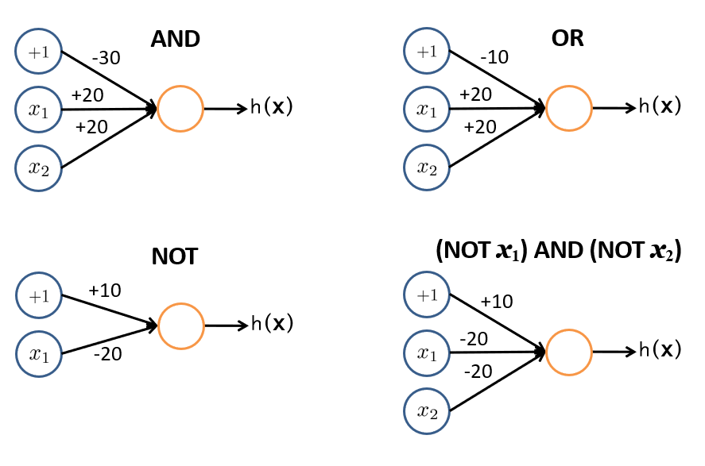
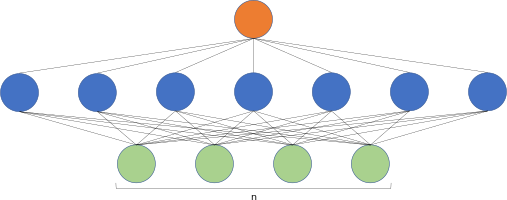
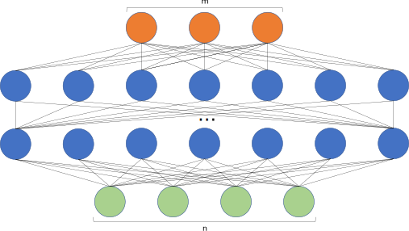
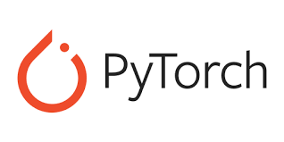
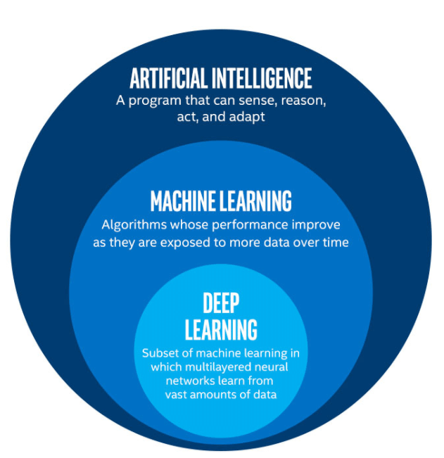
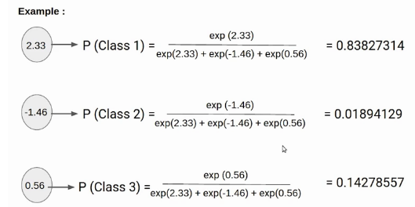
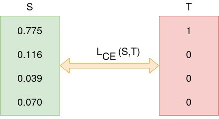
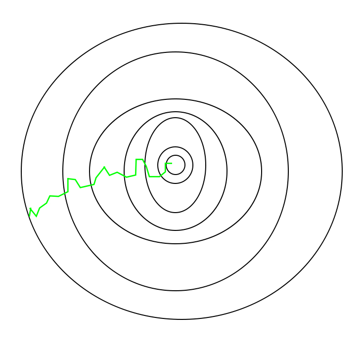
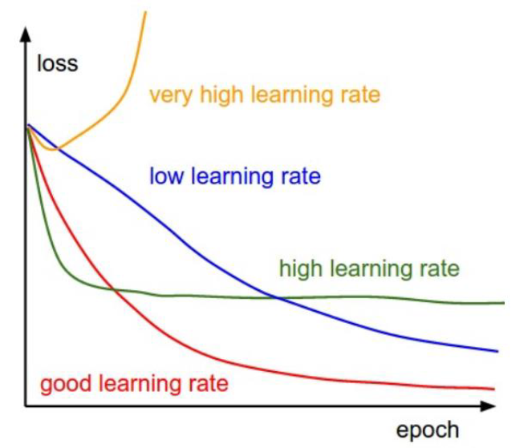
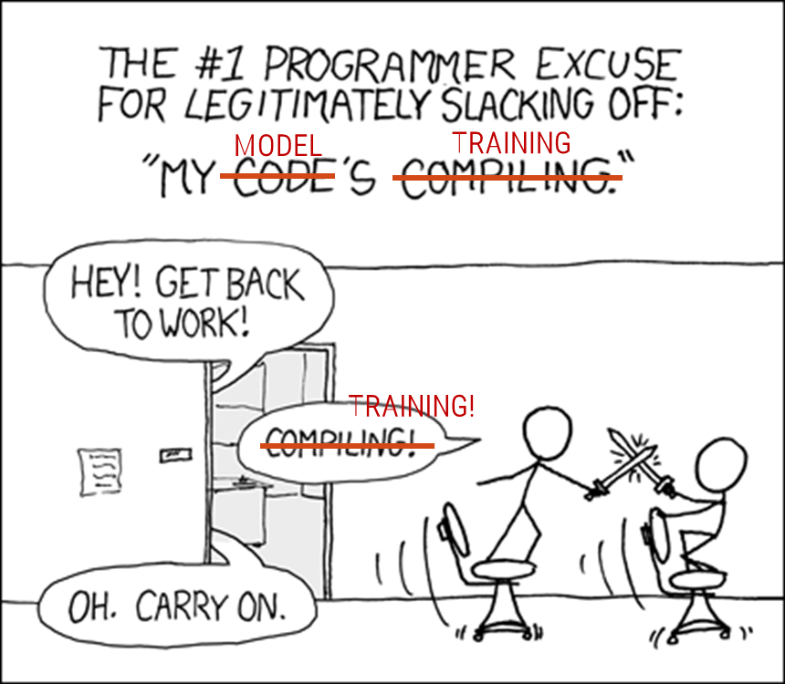

#


# Recalling the Machine Learning pipeline 

We now focus on the model, the "heart" of the AI in our system


- With *model*, we refer to the "mechanism" with which input data are transformed into outputs
- A ML algorithm *trains* a ML model
  - Usually, this "mechanism" is based on math, geometry, statistics, etc.
- Even with the best model available, if I use "dirty" or "insignificant" input data, the system will perform poorly

# Neural Networks

*Neural Networks* (NN): the key idea is to imitate, as far as possible, the neurons of the human brain

- *Networks* since neurons are connected through each other
- Several scientific studies reported the structure of the biological neuron:


- The *axon* carries nerve signals away from the soma (from left to right)
- The *cell body* is where signals are aggregated and processed
- The *dendrites* is where the majority of input to the neuron occurs from other cells

# Artificial Neuron (perceptron)

:::: {.columns}
::: {.column width="50%"}

The first scheme about the neuron has been introduced by [@mcculloch1943logical]

The first Artificial Neuron (AN) has been introduced by *Rosenblatt* in 1957

- *Inputs* are digital numbers (not analog signals)
- Inputs are *weighted* (signals are not all equally important)
- Inputs are *merged* with a sum function (plus a *bias*)
- An *activation function* is used to generate the final output:
  - Also the human brain *filters inputs*, it is impossible to always take everything into account

:::
::: {.column width="50%"}


:::
::::

# An example of a working AN

Will I pass the Machine Learning exam?


$y' = \begin{cases}1, ~if~ 0.3\cdot x_1 + 0.8 \cdot x_2 + 0.5 \cdot x_3 \ge 3\\0, otherwise\end{cases}$

# Examples of working ANs: Boolean functions

How can we implement the following operators?

:::: {.columns}
::: {.column width=33%} 

**not**

<table>
    <tr>
        <td>$x_1$</td>
        <td>0</td>
        <td>1</td>
    </tr>
    <tr>
        <td></td>
        <td>**1**</td>
        <td>*0*</td>
    </tr>
</table>

:::
::: {.column width=33%}

**and**

<table>
    <tr>
        <td>$x_1$ / $x_2$</td>
        <td>0</td>
        <td>1</td>
    </tr>
    <tr>
        <td>0</td>
        <td>*0*</td>
        <td>*0*</td>
    </tr>
    <tr>
        <td>1</td>
        <td>*0*</td>
        <td>**1**</td>
    </tr>
</table>

:::
::: {.column width=33%}

**or**

<table>
    <tr>
        <td>$x_1$ / $x_2$</td>
        <td>0</td>
        <td>1</td>
    </tr>
    <tr>
        <td>0</td>
        <td>*0*</td>
        <td>**1**</td>
    </tr>
    <tr>
        <td>1</td>
        <td>**1**</td>
        <td>**1**</td>
    </tr>
</table>

:::
::::

# Examples of working ANs: Boolean functions

 

# Examples of working ANs: Boolean functions


What about **xor**?

<table>
    <tr>
        <td>$x_1$ / $x_2$</td>
        <td>0</td>
        <td>1</td>
    </tr>
    <tr>
        <td>0</td>
        <td>*0*</td>
        <td>**1**</td>
    </tr>
    <tr>
        <td>1</td>
        <td>**1**</td>
        <td>*0*</td>
    </tr>
</table>

# Linear vs Non-linear problems

A single AN *can solve only linear problems*!


The solution is to use more ANs organized on different layers → **Multi-Layer Perceptron (MLP)**

- It is not so easy, since this introduces several mathematical problems
- Besides, we greatly improve the computational load

# Artificial Neural Networks (ANN)

:::: {.columns}
::: {.column width="65%"}

**Neural Networks** are groups of artificial neurons are organized in different layers

- An *input layer* (input of the network)
- An *output layer* (output of the network)
- One or more *hidden layer(s)*

Each neuron is fully connected with those of the next level.

- Again, we try to imitate the hierarchical nature of our neurons
- We have "only" about ten levels between the retina and the actuator muscles.
- ... otherwise, we would be too slow to react to stimuli.

:::
::: {.column width="30%"}


:::
::::

# ANN typologies

:::: {.columns}
::: {.column width="70%"}

**Feed forward**:

- The connections connect the neurons of one level with the neurons of the next level
- Backward connections or connections to the same level are not allowed

**Recurrent**:

- Feedback connections are expected
  - Generally towards neurons of the same level, but also backward
- Suitable for sequences because they have a (short-term) memory effect

In our course, we will use only FF NN!
 
:::
::: {.column width="30%"}


:::
::::

# Activation functions

**Activation functions** define the output of the neuron given an input or set of inputs:

- They output a small value for small inputs, and a larger value if its inputs exceed a threshold
- They are a sort of switches of the artificial neuron

](./img/neuralnetworks/3 Model55.png)

# Activation functions

:::: {.columns}
::: {.column width=33%} 

**Relu**



:::
::: {.column width=33%}

**Sigmoid**



:::
::: {.column width=33%}

**Linear**



:::
::::

# Universal Approximation Theorem

**Universal Approximation Theorem**: a NN with *at least 1 hidden layer* can approximate any continuous function *to any desired degree of accuracy*, given *sufficient neurons* in that hidden layer, the *right weights and biases*, and a *non-polynomial activation* function.



Limitations

- The theorem applies to feedforward neural networks with $n$ inputs, a single hidden layer ("shallow" and wide), and 1 output
- Achieving a close approximation might require an impractically large number of neurons, making the network hard to train
- The theorem assumes that the "right" weights and biases exist but does not address how to find them
- Not applicable to discontinuous functions

# Håstad's switching lemma [@hastad1986almost]

**Håstad's switching lemma**: certain functions, while easily represented by deep networks with a modest number of neurons, require an exponentially larger number of neurons to represent accurately if constrained to a single hidden layer. 

"Global" functions are harder to be approximated, for instance

- The *parity function* determines whether the number of 1s in a binary input string is odd or even.
- The *majority function* outputs 1 if more than half of the input bits are 1, and 0 otherwise. 

This lemma provides a theoretical foundation for using depth in both circuit complexity and neural networks

- It justifies the need for layered structure when working with complex, globally-dependent functions.

# Universal Approximation Theorem [@kidger2020universal]

[@kidger2020universal]: let $n$ be the number of inputs neurons, $m$ be the number of output neurons, and let $\rho$ be any nonaffine continuous function, with a continuous nonzero derivative at some point.
The class of neural networks of arbitrary depth, width $n + m + 2$ and activation function $\rho$, is dense in $C(K; R^m)$ for $K \subseteq R^n$ with $K$ compact.
This covers any activation function, including polynomial activation functions.



This is why deep neural networks work

# Neural networks training: intuition


# Neural networks training

:::: {.columns}
::: {.column width="70%"}

General considerations about Neural Network architectures

- *Greater number of hidden layers (therefore neurons)*
  - → *better performance*
  - → *need for more training data*
  - → *greater computational load*

How is it possible to train a neural network?

- Training a neural network is complicated, but we can use specific frameworks
- The same happens in Machine Learning and the *scikit-Learn* library

:::
::: {.column width="30%"}




:::
::::

# Deep Neural Networds (DNN)

**Deep Learning**: a branch of ML that avoids the problematic phase of feature extraction (also) with high-dimensional inputs.

:::: {.columns}
::: {.column width="40%"}



:::
::: {.column width="60%"}


:::
::::

Feature extraction requires human intervention.

- ... Often, this is the weak link in the chain!

# ANN and DNN training

Training a NN means tune the weights to optimize the prediction accuracy

- ... by *minimizing* a loss/cost function.



# ANN and DNN training: a visual guide

:::: {.columns}
::: {.column width="50%"}


:::
::: {.column width="50%"}

1. This surface is the solution space of the *loss function*
    - low values → low error
2. *Starting point*
    - Output of the NN with initial (random) weights
3. *Global minimum*: the desired goal point!
4. The learning procedure is performed in an *iterative manner*
    - Following the gradient, the optimizers look for the (global) minimum
5. Each step is proportional to the *learning rate* adopted
6. *Local minimum*
    - The loss function of DL models usually has many local minima.
    - The solution obtained by the final iteration may only locally minimize the loss function.

:::
::::

# ANN and DNN training

The *cost function* is a mathematical formulation of the learning goal

- Measures the error between the prediction and the ground truth (label)
- Presents the performance (or error) in the form of a single real number

**Cross Entropy** is the distance between what the model believes the output distribution should be & what the original distribution is

- In order to use the *Cross Entropy* loss, the output layer must output probabilities.
- *Binary Cross Entropy (BCE)*
  - $Loss = -y_i \cdot log (\hat{y}_i) - (1 - y_i) \cdot log(1 - \hat{y}_i)$
    - $\hat{y}_i$ is the i-th scalar value in the model output (prediction), $y_i$ is the corresponding target (label) value
      - $-y_i \cdot log (\hat{y}_i)$ cancels out if the target is 0
      - $(1 - y_i) \cdot log(1 - \hat{y}_i)$ cancels out if the target is 1
- *Categorical Cross Entropy (CCE)*
  - $Loss = -\sum_i y_i \cdot log(\hat{y}_i)$

# Softmax

The *softmax* layer transforms an n-dimensional vector of real numbers into a vector of real numbers $\in [0, 1]$ which adds up to 1

- The Softmax activation function determines the final probability value of each class $p_i = \frac{e^{a_k}}{\sum_{k=1}^n e^{a_k}}$
- Softmax is a continuously differentiable function.



See also:

- [Cross entropy softmax](https://peterroelants.github.io/posts/cross-entropy-softmax/)
- [Introduction to softmax for neural network](https://www.analyticsvidhya.com/blog/2021/04/introduction-to-softmax-for-neural-network/)

# Cross Entropy + Softmax


:::: {.columns}
::: {.column width="33%"}


$CCE = -log_2 0.755 = 0.3677$

:::
::: {.column width="33%"}

After some training iterations...

:::
::: {.column width="33%"}



$CCE = -log_2 0.0938 = 0.0923$

*The loss function has decreased!*

:::
::::

See [Cross entropy loss function](https://towardsdatascience.com/cross-entropy-loss-function-f38c4ec8643e)

# ANN and DNN training

How to minimize the loss?

- *Adjusting (changing) the weights and the bias of every neuron*


# Gradient descent

**Gradient descent** is a method for unconstrained mathematical optimization.

- It is a first-order iterative algorithm for minimizing a differentiable multivariate function $F(\mathbf {x} )$.
- Take repeated steps in the opposite direction of the gradient of $F(\mathbf {x})$ at the current point: the direction of steepest descent.
- Conversely, stepping in the direction of the gradient will lead to a trajectory that maximizes that function (gradient ascent)

:::: {.columns}
::: {.column width="75%"}

If $F(\mathbf {x})$ is defined and differentiable in a neighborhood of a point $\mathbf {a}$, then

$F(\mathbf {x} )$ decreases fastest in the direction of the negative gradient of $F$ at $\mathbf {a}$, that is $-\nabla F(\mathbf {a} )$.

It follows that, if $\mathbf {a} _{n+1}=\mathbf {a} _{n}-\eta \nabla F(\mathbf {a} _{n})$

For a small enough step size or learning rate $\eta \in \mathbb {R} _{+}$, then $F(\mathbf {a_{n}} ) \geq F(\mathbf {a_{n+1}})$

:::
::: {.column width="25%"}


:::
::::

# Gradient descent

:::: {.columns}
::: {.column width="60%"}

**Vanilla Gradient Descent**

1. Start with random initial values for parameters (weights and biases)
2. Use the current parameters to compute predictions on the training data
3. Compute the cost function
4. Calculate the gradient of the cost function with respect to each parameter $\nabla J(\Theta)$
5. Adjust each parameter in the opposite direction of the gradient. $\Theta = \Theta−\eta \cdot \nabla J(\Theta)$
6. Repeat steps 2–5 for each *epoch (i.e., iteration over the entire dataset)* until the cost function converges to a minimum or reaches a predefined number of epochs

:::
::: {.column width="40%"}


:::
::::

Vanilla Gradient Descent

- Smooth convergence
- Not recommended for huge training dataset → Slow and computationally expensive algorithm

# Gradient descent

:::: {.columns}
::: {.column width="70%"}

**(Mini-batch) Stochastic Gradient Descent (SGD)**

1. Start with random values for parameters (e.g., weights and biases)
2. Split the dataset into multiple small batches of a predefined size
3. For each mini-batch $\mathbf{B}$:
    1. Make predictions using the current parameters for each sample in $\mathbf{B}$
    2. Calculate the cost or error for the mini-batch
    3. Compute the gradient of the cost function with respect to each parameter
    4. Adjust each parameter. $\Theta = \Theta−\eta \cdot \nabla J(\Theta; \mathbf{B})$
4. Go through all mini-batches until every sample in the dataset has been used once (one epoch), then shuffle the dataset and repeat the above process for the next epoch.

:::
::: {.column width="30%"}



:::
::::

Advantages

- *Faster Training*: more frequent parameter updates than batch gradient descent, leading to faster convergence.
- *Efficient GPU/CPU Utilization*: Mini-batch enable parallel processing and faster computation on GPUs.

Drawbacks

- *Selecting an optimal batch size requires some experimentation*, as it can affect both the speed and stability of convergence.
- Mini-batch gradient descent is *less stable than full-batch gradient descent*, especially for small batch sizes.

# Gradient descent

[Many algorithms exist](https://en.wikipedia.org/wiki/Stochastic_gradient_descent#Extensions_and_variants), such as **Adam** (Adaptive Moment Estimation)

- A *stochastic gradient descent* method
- Fewer parameters than SGD

Adam is based on two principles:

- **Momentum**
  - Exponentially decaying average of past gradients to "smooth out" the gradients over multiple steps
  - This helps the optimizer move faster in the direction of the overall gradient, improving convergence speed
- **Adaptive Learning Rates**
  - A moving average tracks the squared gradients, adjusting the learning rate based on the variability of the gradient
  - Parameters with large (small) gradient changes get smaller (larger) learning rates

# [Terminology](https://machinelearningmastery.com/difference-between-a-batch-and-an-epoch/)

**Batch (size)**: the hyperparameter of gradient descent that controls the number of training samples to work through before the model's internal parameters are updated.

- Typically batch size is a multiple of the power of two (16, 32, 64,...)
- Too small batch size can compromise the stability of the learning phase
- The larger the batch size, the more video memory is used! (check your GPU specs)
- Empirically, the batch size may be (at least) equal to the number of classes

**#Iterations**: the size of the training set / the batch size

**Epoch**: the learning procedure is applied to the entire training dataset:

- One epoch means that each sample in the training has had an opportunity to update the weights
- An epoch is comprised of one or more batches (or iterations).
- The number of epochs is traditionally large (10, 100, 1000, ...)

# Delta rule

We can apply the *Widrow-Hoff (delta) Rule* on the *perceptron* (simple gradient descent technique)

For a neuron $j$ with activation function $g(x)$, the delta rule for neuron $j$'s $i$-th weight $w_{ji}$ is given by

$\Delta w_{ij} = \eta (y_i - \hat{y}_i)g'(h_j)x_i$

- $x_i$ is the $i$-th input
- $h$ is the weighted sum of inputs $h_{j}=\sum _{i}x_{i}w_{ji}$
- $g'()$ is the derivative of the activation function
- $\hat{y}_i$ is the actual output, $y_i$ is the target output
- $\eta$ is the learning rate

# Backpropagation

**Backpropagation** (i.e., *backward propagation of errors*) propagates the error to the input of a ANN

- We cannot directly compute the derivative of the loss function with respect to the outputs of the network
- Backpropagation is a local process: neurons are completely unaware of the complete topology of the network
- Apply the *chain rule* to propagate the derivative of the loss function up to the inputs of the network


- The introduction of backpropagation has been fundamental in order to train DNNs!
- Delta rule is a special case of the more general backpropagation algorithm

# Backpropagation

Steps

1. *Forward Pass*: the network takes input data, computes outputs layer by layer, and calculates a final prediction.
    - $\hat{y}=f^{L}(W^{L}f^{L-1}(W^{L-1}\cdots f^{1}(W^{1}x)\cdots))$
1. *Loss Calculation*: the loss function quantifies the difference between the predicted output and the true output.
    - Given an input–output pair (x, y), it is $C(y_i, \hat{y_i}) = C(y,f^{L}(W^{L}f^{L-1}(W^{L-1}\cdots f^{2}(W^{2}f^{1}(W^{1}x))\cdots )))$
1. *Backward Pass*: gradients are computed by propagating the error backward to each layer in the network, using the *chain rule*
1. *Parameter Update*: using gradient descent, each parameter (weight and bias) is updated to reduce the error.

The **chain rule** is used to differentiate composite functions.

- Given two functions $f()$ and $g()$ and $y=f(g(x))$, the chain rule states that $\frac{\delta y}{\delta x} = \frac{\delta y}{\delta g} \cdot \frac{\delta g}{\delta x}$

For instance, given $y = sin(x^2)$, it is:

- $\frac{\delta y}{\delta g} = cos(g)$; $\frac{\delta g}{\delta x} = 2x$; finally, $\frac{\delta y}{\delta x} = cos(x^2) \cdot 2x$

# Backpropagation

The problem with DNNs is that we have hidden layers, the loss functions depend on "hidden parameters" $𝑤$


$C(y,f^{L}(W^{L}f^{L-1}(W^{L-1}\cdots f^{2}(W^{2}f^{1}(W^{1}x))\cdots )))$

- $x$ is the input;
- $z^{l}$ is the weighted input of each hidden layer
- $a^{l}$ is the output of hidden layer $l$ 

Finally, the derivative is $\frac {dC}{da^{L}} \cdot {\frac {da^{L}}{dz^{L}}}\cdot {\frac {dz^{L}}{da^{L-1}}}\cdot {\frac {da^{L-1}}{dz^{L-1}}}\cdot {\frac {dz^{L-1}}{da^{L-2}}}\cdot \ldots \cdot {\frac {da^{1}}{dz^{1}}}\cdot {\frac {\partial z^{1}}{\partial x}}$

# ANN and DNN training: summarizing

:::: {.columns}
::: {.column width="50%"}

1. Loss function → desired goal of the NN
    - *How*?
2. Minimize loss function → moving close to the goal
    - *What does it mean in practice?*
3. Adjusting weights (and bias) of the NN
    - *Through*
4. Gradient Descent → Optimizers
    - Parameters:
        - Learning rate
        - Batch size
        - ...
    - *Based on*
5. Backpropagation + Chain Rule
    - *Therefore*
6. The loss function must be differentiable!

:::
::: {.column width="50%"}



The choice of the right value of the learning rate is important!

:::
::::

# Learning Curves

:::: {.columns}
::: {.column width="50%"}

It is common to create line plots that show epochs along the *x*-axis and the loss value of the model on the *y*-axis.

- 2 plots (usually overlapped):
  - One for the training
  - One for the validation
- These plots are called learning curves.
- Loss values (this is an error, then low values are ok for us!)
- These plots can help to diagnose whether the model has over-learned (*overfitting*), under-learned (*underfitting*), or suitably fits the training dataset.

:::
::: {.column width="50%"}


- Usually, at the beginning of the learning, the value of the loss function drops rapidly
- Starting of the overfitting

:::
::::


# [MLP](https://scikit-learn.org/stable/modules/generated/sklearn.neural_network.MLPClassifier.html) in Scikit-Learn

```python
sklearn.neural_network.MLPClassifier(
    hidden_layer_sizes=(100,),
    activation="relu",
    solver="adam",
    batch_size="auto",
    learning_rate="constant",
    max_iter=200,
    shuffle=True,
    ...
)
```

# Developing AI systems

It is not just important how well a particular classifier works

- *How to develop an AI system*?
- *When is it better to use Machine Learning*? And *Deep Learning*?
- *What about hardware for AI*?

# How to develop an AI project?

- We have seen what are the main steps necessary for the realization of an AI project
  - *Data Collection*
  - *Data Processing* (and feature extraction)
  - *Model training*
  - *Prediction analysis* (through metrics)
- However, there are other important considerations:
  - *When to address a problem through ML*?
  - *When to address a problem through DL*?
  - *What are the hardware resources needed*?
  - *What are the software resources needed*?

# Machine Learning vs Deep Learning

:::: {.columns}
::: {.column width="55%"}

| Element | Machine Learning | Deep Learning |
|:-: |:-: |:-: |
| *Data* | Large data<br />(~ hundreds) | Huge data<br />(~ thousands) |
| *Accuracy* | High accuracy | Best accuracy<br />(high-dimensional data) |
| *Training time* | ~minutes | ~hours, days |
| *Hardware* | CPU | GPU |
| *Features* | Manual | Learned |
| *Interpretability* | Good | Low |

:::
::: {.column width="45%"}


:::
::::

# Hardware for Deep Learning

:::: {.columns}
::: {.column width="70%"}

The training of NN, especially if they are deep, requires specialized hardware:

- Before starting a project with DL, you need to ask if the company/lab has the necessary hardware

Having one or more GPUs available is today a fundamental factor:

- GPUs are essential for parallelizing (and therefore speeding up) calculations.
- As seen, the deeper a network is, the more computational load is introduced

To date, Nvidia, a company that dominates the market:

- The parallelization of the calculations is possible thanks to the CUDA libraries (*Compute Unified Device Architecture*, the true core business of Nvidia)
- Google has started a competition by introducing TPU (*Tensor Processor Unit*)

:::
::: {.column width="30%"}


:::
::::

# Hardware purchase for DL

In-house solution: the company buys the necessary hardware, it is the direct owner

- Pros:
  - Extreme freedom of use of hardware
  - In the long run, it tends to have lower costs
- Cons:
  - Hardware maintenance is required → company needs specialized technicians
  - Hardware ages (quickly) → necessary investments over time
  - For large numbers of GPUs:
    - It is necessary to have specific server rooms → temperature and access control
    - High energy consumption → consumption of the latest generation GPU: ~450W (!)
  - The GPU market is quite expensive and volatile:
    - Very few companies involved in the production process → TMSC
    - Semiconductor shortage
    - External elements influence the market: mining, wars,...

# Hardware for DL: in-house vs external solutions

:::: {.columns}
::: {.column width="60%"}

External solution: the hardware is rented through the *PaaS* paradigm (Cloud)

- Pros:
  - Hardware maintenance is NOT required
  - NO investment over time is required for hardware upgrades
  - Dedicated server rooms are NOT required, energy consumption is not borne by the company
- Cons:
  - In the long run, it tends to have higher costs
  - Cons already seen for cloud-based solutions:
    - Vendor *lock-in* → it is difficult to escape from the service provider
    - Who really owns the data?
    - Privacy issues

:::
::: {.column width="40%"}


:::
::::

Examples:

- [https://cloud.google.com/products/calculator/](https://cloud.google.com/products/calculator/)
- [https://www.leadergpu.com/#chose-best](https://www.leadergpu.com/#chose-best)
- [https://buomsoo-kim.github.io/colab/2020/03/15/Google-newly-launches-colab-pro.md/](https://buomsoo-kim.github.io/colab/2020/03/15/Google-newly-launches-colab-pro.md/)
- [https://calculator.aws/#/addService/EC2](https://calculator.aws/#/addService/EC2)


# 

:::: {.columns}
::: {.column width="50%"}


:::
::: {.column width="50%"}



:::
::::

Demos

- [Playground tensorflow](https://playground.tensorflow.org)
- [Convnetjs](https://cs.stanford.edu/people/karpathy/convnetjs/)

# References