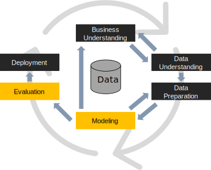

# Recalling the Machine Learning pipeline 

* In these slides we focus on the model, the real “heart” of the AI in our system
* It is one of the most delicate and decisive elements of the entire process:
  * Here, with the word “model”, we refer to the “mechanism” with which input data are transformed into outputs
  * Usually, this “mechanism” is based on math, geometry, statistics,...
  * Remember that the other steps are also important: even with the best classifier available if I use “dirty” (not correctly pre-processed) or insignificant input data, the system will perform poorly.

# Definitions

**Deep Learning**: a discipline, similar to ML, that allows you to avoid the problematic phase of feature extraction (also) with high-dimensional input.

- Essentially, it is based on *Neural Networks*.


Feature extraction requires human intervention.

- ... Often, this is the weak link in the chain!

# Neural Networks

*Neural Networks* (NNs): the key idea is to imitate, as far as possible, nature.

  * In particular, we try to imitate the neurons of the human brain (an *incredible* and *powerful* machine!)
  * *Networks* since neurons are connected through each other
  * Several scientific studies reported the structure of the biological neuron:

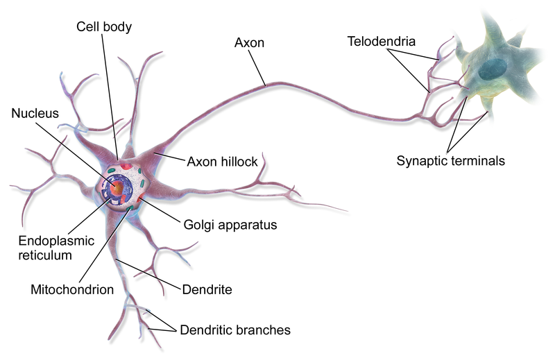

- The axon primarily carries nerve signals away from the soma (from left to right)
- Cell body: this is where signals are «aggregated»
- Dendrites: this is where the majority of input to the neuron occurs from other cells

# Artificial Neuron (perceptron)

:::: {.columns}
::: {.column width="50%"}

* The first scheme about the neuron has been introduced by [@mcculloch1943logical]
* The first Artificial Neuron (AN) has been introduced by *Rosenblatt* in 1957
* In the artificial neuron, there are:
  * *Inputs*: in our case, they are digital numbers! (not an analog signal)
  * Inputs are *weighted* (signals are not all equally important)
  * Inputs are *merged* with a sum function (plus a *bias*)
  * An *activation function* is used to generate the final output:
    * Also the human brain *filters inputs*, so it would be impossible to always take everything into account.

:::
::: {.column width="50%"}


:::
::::

# Activation functions

Activation functions define the output of the neuron given an input or set of inputs:

* They are a sort of switches of the artificial neuron.
* They output a small value for small inputs, and a larger value if its inputs exceed a threshold.


See also [Activation Functions](https://medium.com/@shrutijadon/survey-on-activation-functions-for-deep-learning-9689331ba092)

# An example of a working AN

> Will I pass the Machine Learning exam?
>
>

# Another example of a working AN

:::: {.columns}
::: {.column width="60%"}


$y' = \begin{cases}1, ~if~ 0.3x_1 + 0.3x_2 + 0.3x_3 -0.4 > 0\\-1, ~if~ 0.3x_1 + 0.3x_2 + 0.3x_3 -0.4 < 0\end{cases}$

:::
::: {.column width="40%"}

| $x_1$ | $x_2$ | $x_3$ | | y’ |
| :-: | :-: | :-: | :-: | :-: |
| 1 | 0 | 0 || -1 
| 1 | 0 | 1 || 1 |
| 1 | 1 | 0 || 1 |
| 1 | 1 | 1 || 1 |
| 0 | 0 | 1 || -1 |
| 0 | 1 | 0 || -1 |
| 0 | 1 | 1 || 1 |
| 0 | 0 | 0 || -1 |

:::
::::

# An example of a working AN: Boolean functions

:::: {.columns}
::: {.column width="60%"}

 

:::
::: {.column width="40%"}

**and**

<table>
    <tr>
        <td>$x_1$ / $x_2$</td>
        <td>0</td>
        <td>1</td>
    </tr>
    <tr>
        <td>0</td>
        <td>*0*</td>
        <td>*0*</td>
    </tr>
    <tr>
        <td>1</td>
        <td>*0*</td>
        <td>**1**</td>
    </tr>
</table>

**xor**

<table>
    <tr>
        <td>$x_1$ / $x_2$</td>
        <td>0</td>
        <td>1</td>
    </tr>
    <tr>
        <td>0</td>
        <td>*0*</td>
        <td>**1**</td>
    </tr>
    <tr>
        <td>1</td>
        <td>**1**</td>
        <td>*0*</td>
    </tr>
</table>


:::
::::
# Linear vs Non-linear problems

* Unfortunately, a single AN can solve only linear problems!
* The solution is to use more ANs organized on different layers → Multi-Layer Perceptron  (MLP)
  * It is not so easy, since this introduces several mathematical problems
  * Besides, we greatly improve the computational load


# Artificial Neural Networks

:::: {.columns}
::: {.column width="65%"}

* Groups of artificial neurons are organized in different layers → Neural Networks!
* Typically, are present:
  * An input layer (input of the network)
  * An output layer (output of the network)
  * One or more hidden layer (s)
* Each neuron is fully connected with those of the next level.
* Again, we try to imitate the hierarchical nature of our neurons:
  * We have “only” about ten levels between the retina and the actuator muscles.
  * Otherwise, we would be too slow to react to stimuli.

:::
::: {.column width="30%"}

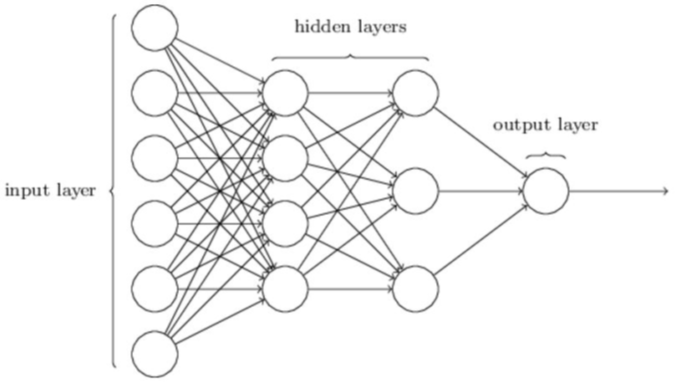

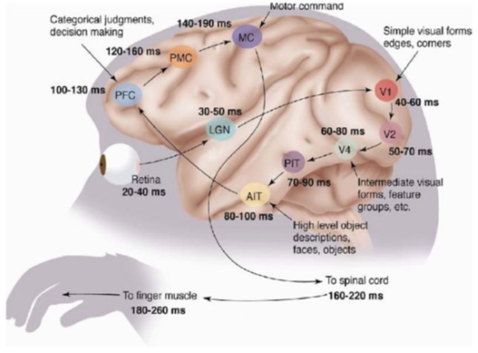

:::
::::

# ANN typologies

:::: {.columns}
::: {.column width="70%"}

* **Feedforward**:
  * The connections connect the neurons of one level with the neurons of the next level
  * Backward connections or connections to the same level are not allowed
  * It is by far the most used type of network.
* **Recurrent**:
  * Feedback connections are expected (generally towards neurons of the same level, but also backward)
  * More suitable for the management of sequences because they have a (short-term)  memory effect
* In our course, we will use only FF NN!

:::
::: {.column width="30%"}

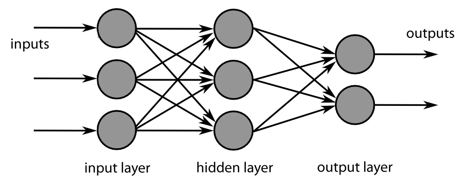

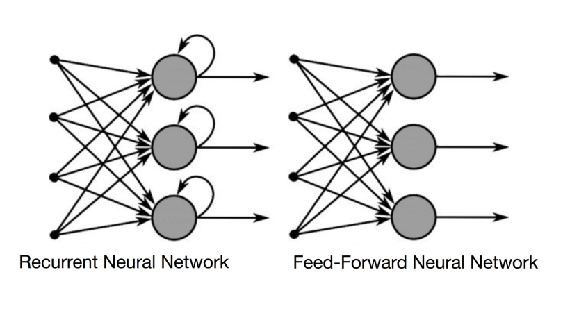

:::
::::

# Neural Networks training

* General considerations about Neural Network architectures:
  * Greater number of hidden layers (therefore neurons) → better performance
  * Greater number of hidden layers (therefore neurons) → need for more training data
  * Greater number of hidden layers (therefore neurons) → greater computational load
* How is it possible to train a neural network?
  * Training a neural network is extremely complicated, but we can use specific frameworks:
  * The same happens in Machine Learning, in which we can use the *Scikit-Learn* library to train our own classifiers.

:::: {.columns}
::: {.column width="33%"}


:::
::: {.column width="33%"}


:::
::: {.column width="33%"}


:::
::::

#

Do you remember the example of how we learn to play the guitar?

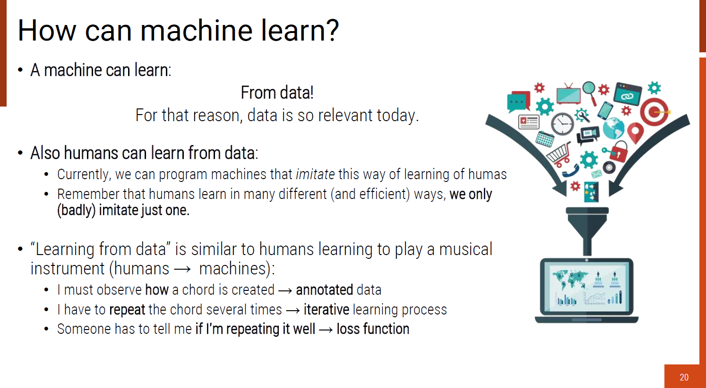

# Neural Networks training: intuition

The same happens with Neural Networks.

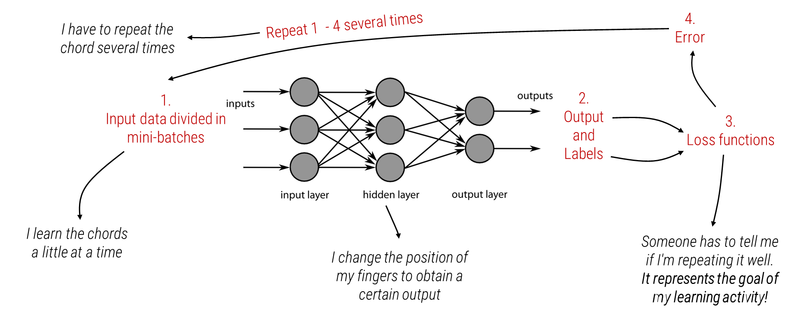

# DNN Training

Training a NN means minimizing the loss/cost function.

The cost function:

- It is a mathematical formulation of the learning goal
- Measures the error between the prediction and the ground truth (label)
- Presents the performance (or error) in the form of a single real number

Loss functions for the classification task:

- Cross Entropy indicates the distance between what the model believes the output distribution should be, and what the original distribution really is.
- *Binary Cross Entropy (BCE)*: $Loss = -y_i \cdot log (\hat{y}_i) - (1 - y_i) \cdot log(1 - \hat{y}_i)$
    - $\hat{y}_i$ is the i-th scalar value in the model output (prediction), $y_i$ is the corresponding target (label) value
        - $-y_i \cdot log (\hat{y}_i)$ cancels out if the target is 0
        - $(1 - y_i) \cdot log(1 - \hat{y}_i)$ cancels out if the target is 1
- *Categorical Cross Entropy (CCE)*: $Loss = -\sum_i y_i \cdot log(\hat{y}_i)$

# Softmax classification

In order to use the *Cross Entropy* loss, the output layer must output probabilities.

Then, we can use *softmax* layer that takes an *n*-dimensional vector of real numbers and transforms it into a vector of real numbers in range (0,1)  which adds up to 1.

- Softmax is a continuously differentiable function.
- The Softmax activation function determines the final probability value of each class $p_i = \frac{e^{a_k}}{\sum_{k=1}^n e^{a_k}}$


See also:

- [https://peterroelants.github.io/posts/cross-entropy-softmax/](https://peterroelants.github.io/posts/cross-entropy-softmax/)
- [https://www.analyticsvidhya.com/blog/2021/04/introduction-to-softmax-for-neural-network](https://www.analyticsvidhya.com/blog/2021/04/introduction-to-softmax-for-neural-network/)

# Cross Entropy


:::: {.columns}
::: {.column width="33%"}


$CCE = -log_2 0.755 = 0.3677$

:::
::: {.column width="33%"}

After some iterations...

:::
::: {.column width="33%"}


$CCE = -log_2 0.0938 = 0.0923$

*The loss function is decreased!*

:::
::::

[https://towardsdatascience.com/cross-entropy-loss-function-f38c4ec8643e](https://towardsdatascience.com/cross-entropy-loss-function-f38c4ec8643e)

# DNN Training

How to minimize the loss?


Adjusting (change) the weights and the bias of every neuron

[https://medium.com/analytics-vidhya/backpropagation-for-dummies-e069410fa585](https://medium.com/analytics-vidhya/backpropagation-for-dummies-e069410fa585)

# DNN Training

:::: {.columns}
::: {.column width="50%"}

Different optimizers:

* Vanilla Gradient Descent
  * Computes the gradient of the cost function w.r.t. to the parameters for the entire training dataset
  * Not suggested for huge training dataset → Slow and computationally expensive algorithm
* Stochastic Gradient Descent (SGD)
  * For each iteration, a sample of data (*batch*) is selected
  * Gradients are computed on each iteration
  * The path taken by the algorithm to reach the minima is usually noisier
  * It requires several hyperparameters
* Adam
  * A *stochastic gradient descent* method
  * Fewer parameters than SGD
  * Computationally efficient, has little memory requirement

:::
::: {.column width="50%"}


:::
::::

# How to compute gradients

* Simple case: the network has only 1 layer
  * We can apply a simple gradient descent technique, *i.e.* the delta rule (or *Widrow-Hoff Rule*) on the *Perceptron*
    * $\Delta w_{ij} = \eta (\hat{y}_i - y_i)g'(h_j)x_i$
  * Alpha learning rate, $g(x)$ is the activation function, $y_i$ is the target output, $h$ is the weighted sum of inputs, $\hat{y}_i$ is the actual output and $x$ is the input
* But with one or more hidden layers, it is not possible to apply the Delta rule! 
  * We need an additional mechanism → backpropagation
  * Delta rule is a special case of the more general backpropagation algorithm
  * Remember that hidden layers are fundamental for Deep Learning!
  * Without backpropagation we cannot propagate the error, computed on the loss function, to the input of the network → the introduction of backpropagation has been fundamental in order to train DNNs!

# Backpropagation

How to compute gradients? ($\frac{\delta L}{\delta w}$)?

- The problem with DNNs is that we have hidden layers, the loss functions depend on “hidden parameters” (𝑤) but we are able to observe only the output.
- We can then use an algorithm to compute the gradients of the loss functions with respect to all its parameters called backpropagation, a procedure based on the chain rule
  - $\frac{d_z}{d_x} = \frac{d_z}{d_y} \frac{d_y}{d_z}$
  - $z=f(g(x))$
  - $y=g(x)$


# Backpropagation

* Backpropagation is a  local process. Neurons are completely unaware of the complete topology of the network in which they are embedded.
  * Remember: we cannot directly compute the derivative of the loss function with respect to the output of the network (it is not «visible» from hidden layers!)
  * We can apply the *backpropagation* and the *chain rule * to propagate the derivative of the loss function up to the inputs of the network.

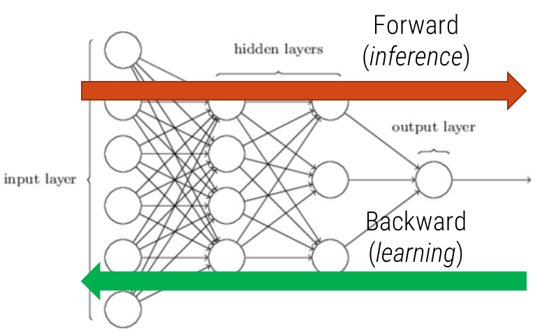

It proceeds backward w.r.t the flow of computations performed to compute the loss itself (hence the name).

# Optimization procedure: a visual guide

:::: {.columns}
::: {.column width="50%"}


:::
::: {.column width="50%"}

1. This surface is the solution space of the loss function
    - low values → low error
2. Starting point
    - Output of the NN with initial (random) weights
3. Global minimum
    - The desired goal point!
4. The learning procedure is performed in an iterative manner, step by step. Following the gradient, the optimizers look for the (global) minimum
5. Each step is proportional to the learning rate adopted
6. Local minimum
    - The loss function of DL models usually has many local minima. The solution obtained by the final iteration may only locally minimize the loss function.

:::
::::

# DNN training: summarizing

:::: {.columns}
::: {.column width="50%"}

1. Loss function → desired goal of the NN
    - *How*?
2. Minimize loss function → moving close to the goal
    - *What does it mean in practice?*
3. Adjusting weights (and bias) of the NN
    - *Through*
4. Gradient Descent → Optimizers
    - Parameters:
        - Learning rate
        - Batch size
        - ...
    - *Based on*
5. Backpropagation + Chain Rule
    - *Therefore*
6. The loss function must be derivable !!

:::
::: {.column width="50%"}


The choice of the right value of the learning rate is important!

:::
::::

# Terminology in DNN training

* **Batch (size)**: the hyperparameter of gradient descent that controls the number of training samples to work through before the model’s internal parameters are updated.
  * Typically batch size is a multiple of the power of two (16, 32, 64,...)
  * Too small batch size can compromise the stability of the learning phase
  * The larger the batch size, the more video memory is used! (check your GPU specs)
  * Empirically, the batch size may be (at least) equal to the number of classes
* **Iteration**: #iterations = the size of the training set / the batch size
* **Epoch**:  the learning procedure is applied to the entire training dataset:
  * One epoch means that each sample in the training has had an opportunity to update the weights
  * An epoch is comprised of one or more batches (or iterations).
  * The number of epochs is traditionally large (10, 100, 1000,...)

[https://machinelearningmastery.com/difference-between-a-batch-and-an-epoch/](https://machinelearningmastery.com/difference-between-a-batch-and-an-epoch/)

# Learning Curves

:::: {.columns}
::: {.column width="50%"}

It is common to create line plots that show epochs along the *x*-axis and the loss value of the model on the *y*-axis.

* 2 plots (usually overlapped):
  * One for the training
  * One for the validation
* These plots are called learning curves.
* Loss values (this is an error, then low values are ok for us!)
* These plots can help to diagnose whether the model has over-learned (*overfitting*), under-learned (*underfitting*), or suitably fits the training dataset.

:::
::: {.column width="50%"}


- Usually, at the beginning of the learning, the value of the loss function drops rapidly
- Starting of the overfitting

:::
::::


# [MLP](https://scikit-learn.org/stable/modules/generated/sklearn.neural_network.MLPClassifier.html) in Scikit-Learn

```python
sklearn.neural_network.MLPClassifier(
    hidden*layer*sizes=(100,),
    activation='relu’,
    solver='adam’,
    batch*size='auto’,
    learning*rate='constant’,
    max*iter=200,
    shuffle=True,
    ...
)
```

# Developing AI systems

* It is not just important how well a particular classifier works
* Related choices are also very important, which concern not only technical aspects but also managerial aspects, since:
  * They affect the project development time
  * They affect the amount of resources invested
  * They affect the need for developers
* We will quickly reflect on the following questions:
  * How to develop an AI system?
  * When is it better to use Machine Learning? And Deep Learning?
  * What about hardware for AI?


# How to develop an AI project?

* We have seen what are the main steps necessary for the realization of an AI project
  * Data
  * Data Processing (and feature extraction)
  * Model training
  * Prediction analysis (through metrics)
* However, there are other important considerations:
  * When to address a problem through ML?
  * When to address a problem through DL?
  * What are the hardware resources needed?
  * What are the software resources needed?

# Machine Learning vs Deep Learning

| Element | Machine Learning | Deep Learning |
|:-: |:-: |:-: |
| Data | Large data<br />(~ hundreds) | Huge data<br />(~ thousands) |
| Accuracy | High accuracy | Best accuracy<br />(esp. high-dimensional data) |
| Training time | Less time<br />(~minutes) | Large Time<br />(~hours, days) |
| Required hardware | CPU | GPU |
| Features | Manual | Learned |
| Interpretability | Good | Low |

# Machine Learning vs Deep Learning

The superiority of DL approaches over other Machine Learning algorithms manifests itself when large (huge)  quantities of training data are available.

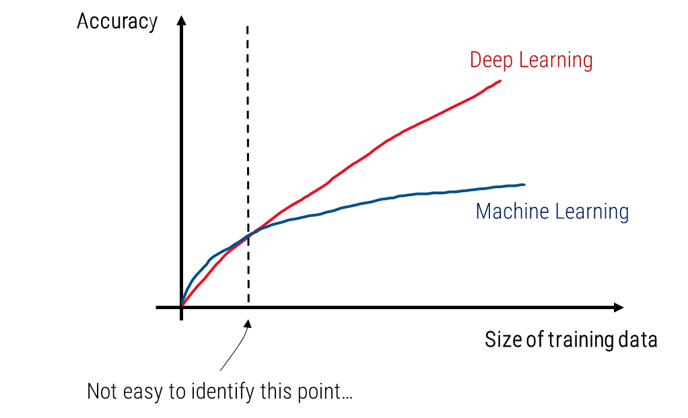

# Hardware for Deep Learning

:::: {.columns}
::: {.column width="60%"}

* The training of neural networks, especially if they are deep, requires specialized hardware:
    * Before starting a project with DL, you need to ask if the company/lab has the necessary hardware
* Having one or more GPUs available is today a fundamental factor:
    * GPUs are essential for parallelizing (and therefore speeding up) calculations.
    * As seen, the deeper a network is, the more computational load is introduced
* To date, the only usable GPUs are produced by Nvidia, a company that dominates the market:
    * Google has started a competition by introducing TPU (*Tensor Processor Unit*) on the market, but they are not yet widespread and used
    * The parallelization of the calculations is possible thanks to the CUDA libraries (*Compute Unified Device Architecture*, the true core business of Nvidia)

:::
::: {.column width="30%"}


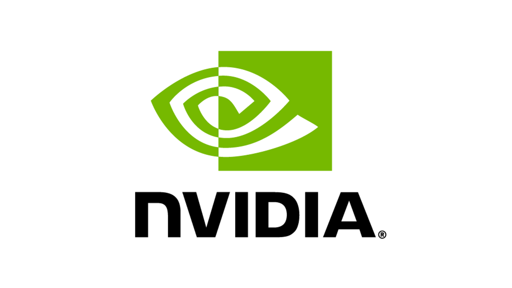

:::
::::

# Training DNNs...

:::: {.columns}
::: {.column width="50%"}


:::
::: {.column width="50%"}


:::
::::

# Hardware purchase for DL

* In-house solution: the company buys the necessary hardware, it is the direct owner
  * Pros:
    * Extreme freedom of use of hardware
    * In the long run, it tends to have lower costs
  * Cons:
    * Hardware maintenance is required → company needs specialized technicians
    * Hardware ages (quickly) → necessary investments over time
    * For large numbers of GPUs:
      * It is necessary to have specific server rooms → temperature and access control
      * High energy consumption → consumption of the latest generation GPU: ~450W (!)
    * The GPU market is quite expensive and volatile:
      * Very few companies involved in the production process → TMSC
      * Semiconductor shortage
      * External elements influence the market: mining, wars,...

# Hardware for DL: in-house vs external solutions

:::: {.columns}
::: {.column width="60%"}

* External solution: the hardware is rented through the *PaaS* paradigm (Cloud)
  * Pros:
    * Hardware maintenance is NOT required
    * NO investment over time is required for hardware upgrades
    * Dedicated server rooms are NOT required, energy consumption is not borne by the company
  * Cons:
    * In the long run, it tends to have higher costs
    * Cons already seen for cloud-based solutions:
      * Vendor *lock-in* → it is difficult to escape from the service provider
      * Who really owns the data?
      * Privacy issues

:::
::: {.column width="40%"}

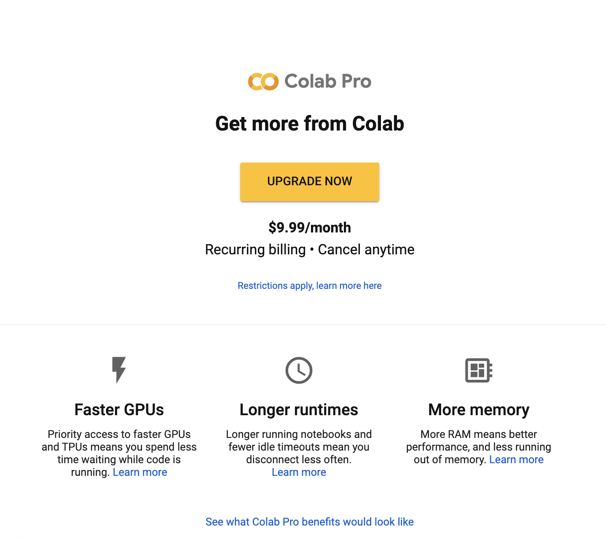

:::
::::

Examples:

* [https://cloud.google.com/products/calculator/](https://cloud.google.com/products/calculator/)
* [https://www.leadergpu.com/#chose-best](https://www.leadergpu.com/#chose-best)
* [https://buomsoo-kim.github.io/colab/2020/03/15/Google-newly-launches-colab-pro.md/](https://buomsoo-kim.github.io/colab/2020/03/15/Google-newly-launches-colab-pro.md/)
* [https://calculator.aws/#/addService/EC2](https://calculator.aws/#/addService/EC2)

# Interactive demos

- https://playground.tensorflow.org 
- https://cs.stanford.edu/people/karpathy/convnetjs/ 

# The end(?) of our AI journey


# References